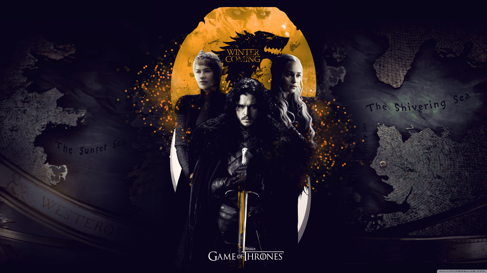
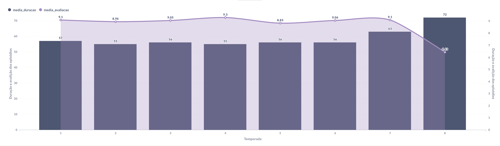
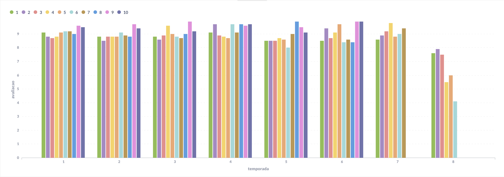
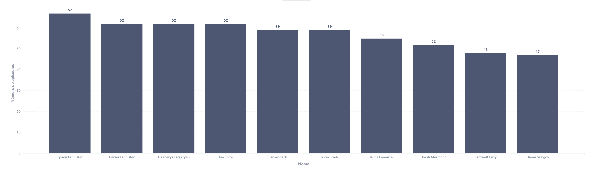

# **Game of Thrones - Data Analysis**

 

## **Descrição do Projeto:**

 

🚀 Projeto desenvolvido para avaliação do Módulo 3 - Resilia.    Neste projeto foi desenvolvido um banco de dados MySQL para consultas e geração de gráficos através de ferramentas de BI, nesse caso o Metabase

 

<h4 align="center"> 
	✅  GOT - Data Analysis 🚀 Finalizado  ✅
</h4>

## **📜 Perguntas:**

 

- Quais atores tiveram maior frequencia de aparição em episodios?
- Qual a média de duração de episodios por temporada?
- Quais foram as avaliações por temporada?
- Qual a relação entre duração de episodio e sua avaliação por temporadas?
- Qual a relação entres as avaliações por episódio e temporada?
- Qual a porcentegem de personagens que aparecem a partir da 4ª temporada e permanecem até a ultima?
- Quantas casas existem por região?
- Quantos personagens possui a série GOT?
- Qual o nome dos episódios mais longos de todas as temporadas?
   
   

## **📊 Resultados:**

 

 
 

## **🛠 Tecnologias:**

 

- [MySQL](https://www.mysql.com/)
- [Docker](https://www.docker.com/)
- [Metabase](https://www.metabase.com/)

 

## **Contribuição:**

 

<table align="center">
  <tr>
    <td align="center"> <b>Ana Cornachi</b></a> <a href="https://github.com/anacornachi" title="Github">💻</a> <a href="https://www.linkedin.com/in/anacornachi/" title="Linkedin">💼</a>
    <td align="center"> <b>Ivan Geier</b></a> <a href="https://github.com/ivangeier" title="Github">💻</a> <a href="https://www.linkedin.com/in/ivangeier/" title="Linkedin">💼</a></td>
   <td align="center"> <b>Laissa Fernandes</b></a> <a href="https://github.com/laissafernandes" title="Github">💻</a> <a href="https://www.linkedin.com/in/laissafernandes/" title="Linkedin">💼</a>
   <td align="center"> <b>Luis Antonio</b></a> <a href="https://github.com/LagAntunes" title="Github">💻</a> <a href="https://www.linkedin.com/in/luis-antonio-garcia-antunes/" title="Linkedin">💼</a>
   <td align="center"> <b>Murilo Antunes</b></a> <a href="https://github.com/mjantunes2" title="Github">💻</a> <a href="https://www.linkedin.com/in/murilo-josé-antunes-bb1143228/" title="Linkedin">💼</a>
  </tr>
</table>

 

---

 

Desenvolvido com 💛 pelo grupo 3 • T10 • Resilia Educação

